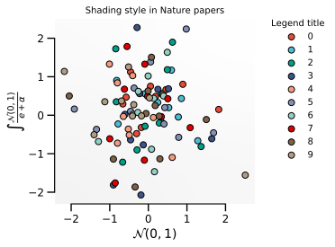
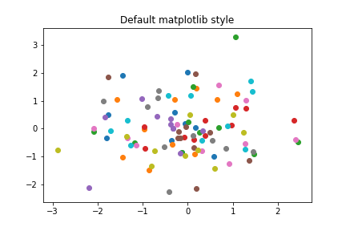
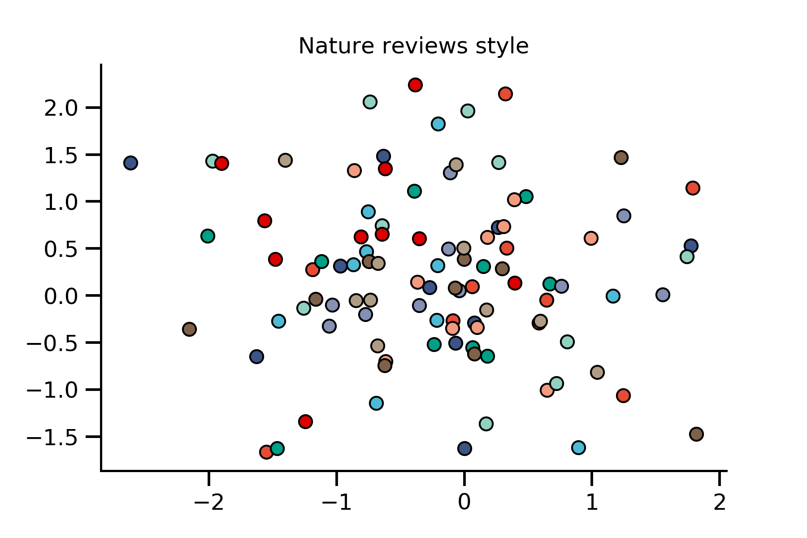
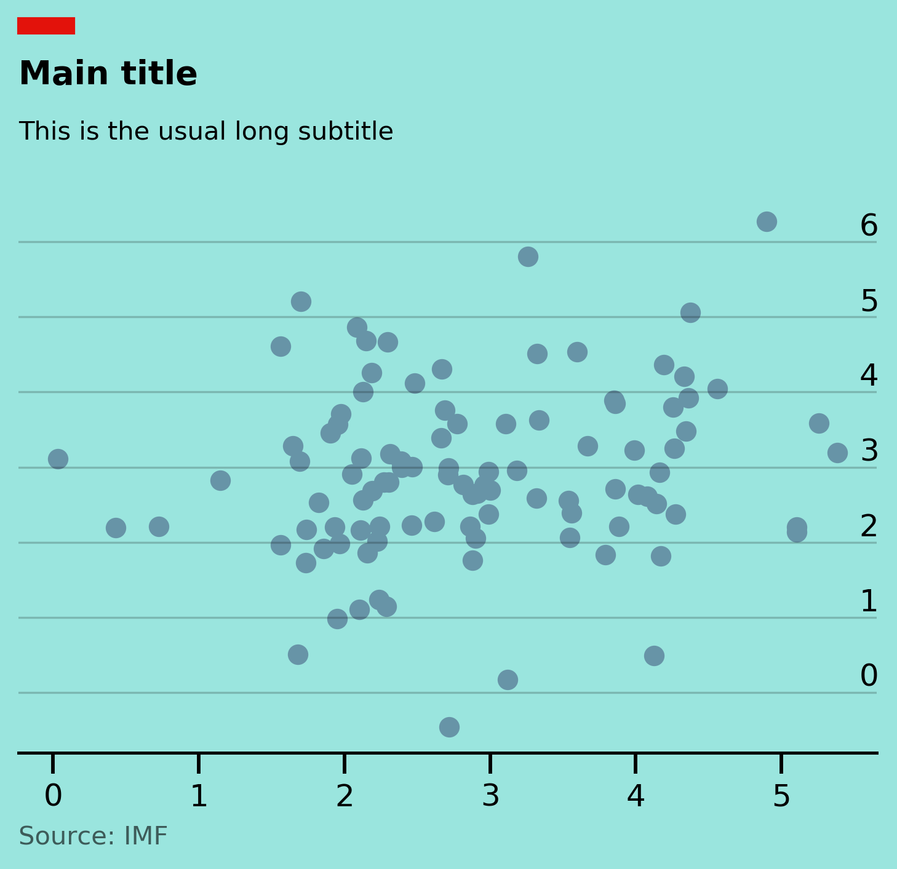

# sciplotlib


## sciplotlib is just a set of simple functions and stylesheets for more professional looking plots 



There are two main properties that make plots in papers look the way they do: 

 1. default style properties such as typeface, color scheme, 
 2. specific choices in terms of the placement of tick marks, or additional elements that are added to the plot such as shading or shadows 
 
 
### Stylesheets

sciplotlib aims to make (1) easier by providing stylesheets that aims to mimic the style properties found in scientific papers: 


We can compare the default matplotlib style with a style that mimics scatter plots found in articles from the Nature publishing group:

```python
import matplotlib.pyplot as plt
import numpy as np

def make_plot():
    fig, ax = plt.subplots()
    num_categories = 10
    num_points = 10
    for category in np.arange(num_categories):
        x = np.random.normal(size=num_points)
        y = np.random.normal(size=num_points)
        ax.scatter(x, y)

    return fig, ax
	

fig, ax = make_plot()
ax.set_title('Default matplotlib style')

```





Applying the most basic style is just one line of code 

```python 
from sciplotlib import style as spstyle

with plt.style.context(spstyle.get_style('nature-reviews')):
    fig, ax = make_plot()
    
ax.set_title('Nature reviews style')
```





### Modifying figure properties 

sciplotlib also aims to make (2) easier by providing functions that automically add elements found in scientific plots. For example, in many scientific journals it is common for the axis to extend only from and up to the last tick mark, and in figures found in Nature review articles, it is also common that shading will be added to plots, these are implemented by functions that simpy takes in the figure handles and return them:

```python 
from sciplotlib import style as spstyle
from sciplotlib import polish as sppolish

with plt.style.context(spstyle.get_style('nature-reviews')):
    fig, ax = make_plot()
    fig, ax = sppolish.set_bounds(fig, ax)
    sppolish.apply_gradient(ax, extent=None, 
                    direction=0.3, cmap_range=(0.1, 0),
                    cmap='Greys')
    
ax.set_title('Nature reviews style with bells and whistles')
```


## Installation 

Simply do 

`pip install sciplotlib`


## Acknowledgments

sciplotlib is built on top of matplotlib. To cite matplotlib in your publications, cite:

J. D. Hunter, "Matplotlib: A 2D Graphics Environment", Computing in Science & Engineering, vol. 9, no. 3, pp. 90-95, 2007

Other projects that is also built on the idea of providing stylesheets / wrappers for scientific plots include: 

 - https://github.com/garrettj403/SciencePlots
 
Color palettes of scientific papers are obtained from the wonderful `ggsci` library:

https://cran.r-project.org/web/packages/ggsci/vignettes/ggsci.html

## Contributing 

Do contact me if you are interested in adding new functions or templates to this repository.


## Other fun stuff 

I am also including other aesthetically pleasing plot styles that are non-academic. For example, to create plots from The Economist, do: 


```python 
import numpy as np
import matplotlib.pyplot as plt
from sciplotlib import style as spstyle
from sciplotlib import misc as spmis


with plt.style.context(spstyle.get_style('economist')):
    fig, ax = plt.subplots()
    ax.scatter(x, y)
    ax.text(0, 1.2, 'Main title', weight='bold', size=13, transform=ax.transAxes)
    ax.text(0, 1.1, 'This is the usual long subtitle', transform=ax.transAxes)
    fig, ax = spmisc.add_economist_rectangle(fig, ax, xloc=0.125, yloc=1.1, width=0.05, height=0.02)
    fig, ax = spmisc.add_datasource(fig, ax, s='Source: IMF', xloc=0.125, yloc=0, alpha=0.6)

```





