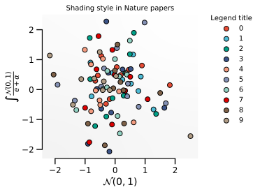
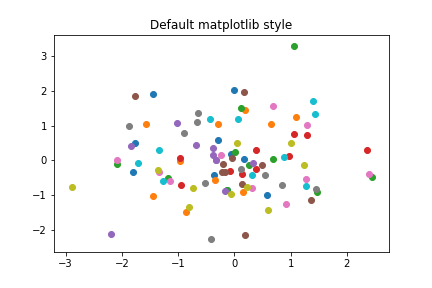
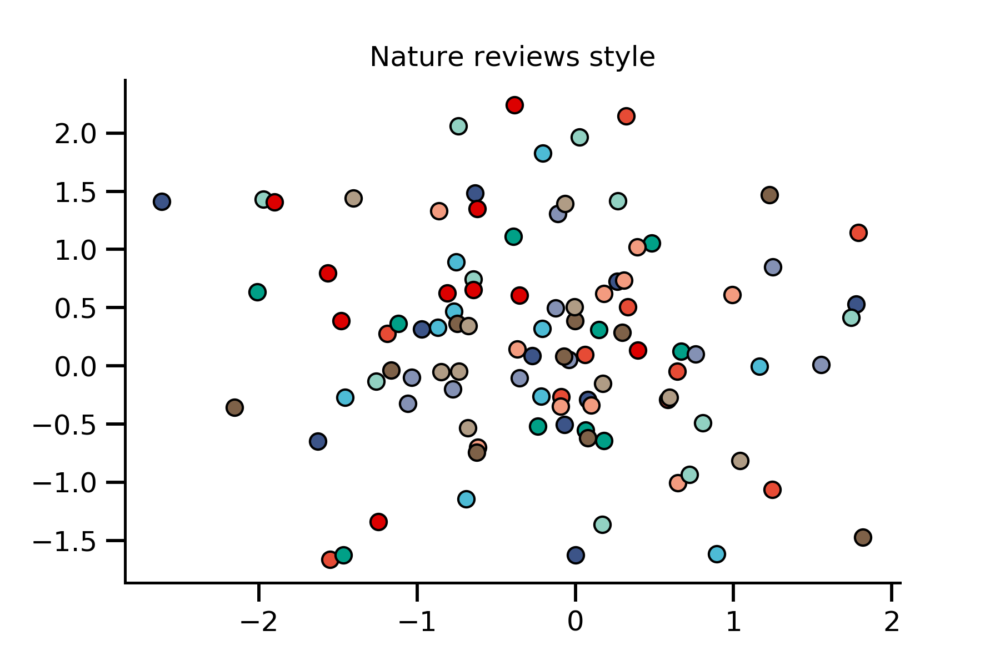
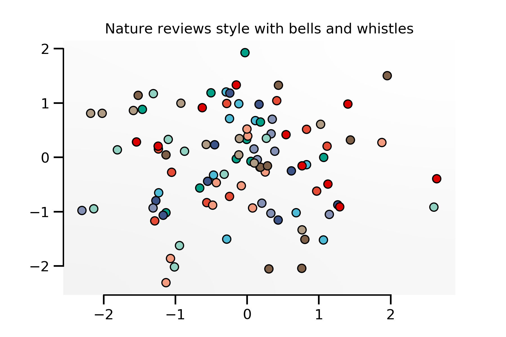
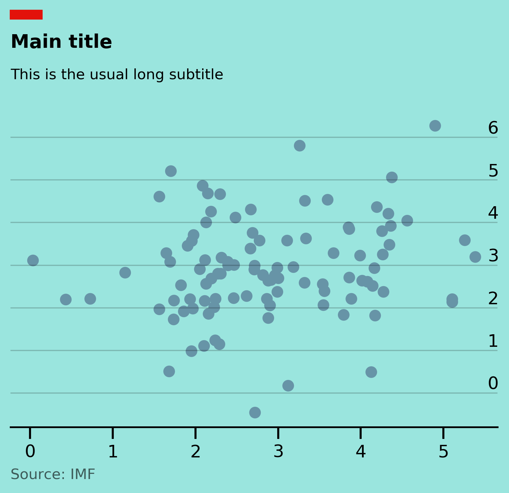

# sciplotlib


## sciplotlib is just a set of simple functions and stylesheets for more professional looking plots 



There are two main properties that make plots in papers look the way they do: 

 1. default style properties such as typeface, color scheme, 
 2. specific choices in terms of the placement of tick marks, or additional elements that are added to the plot such as shading or shadows 
 
 
### Stylesheets

sciplotlib aims to make (1) easier by providing stylesheets that aims to mimic the style properties found in scientific papers: 


We can compare the default matplotlib style with a style that mimics scatter plots found in articles from the Nature publishing group:

```python
import matplotlib.pyplot as plt
import numpy as np

def make_plot():
    fig, ax = plt.subplots()
    num_categories = 10
    num_points = 10
    for category in np.arange(num_categories):
        x = np.random.normal(size=num_points)
        y = np.random.normal(size=num_points)
        ax.scatter(x, y)

    return fig, ax
	

fig, ax = make_plot()
ax.set_title('Default matplotlib style')

```





Applying the most basic style is just one line of code 

```python 
from sciplotlib import style as spstyle

with plt.style.context(spstyle.get_style('nature-reviews')):
    fig, ax = make_plot()
    
ax.set_title('Nature reviews style')
```





### Modifying figure properties 

sciplotlib also aims to make (2) easier by providing functions that automically add elements found in scientific plots. For example, in many scientific journals it is common for the axis to extend only from and up to the last tick mark, and in figures found in Nature review articles, it is also common that shading will be added to plots, these are implemented by functions that simpy takes in the figure handles and return them:

```python 
from sciplotlib import style as spstyle
from sciplotlib import polish as sppolish

with plt.style.context(spstyle.get_style('nature-reviews')):
    fig, ax = make_plot()
    fig, ax = sppolish.set_bounds(fig, ax)
    sppolish.apply_gradient(ax, extent=None, 
                    direction=0.3, cmap_range=(0.1, 0),
                    cmap='Greys')
    
ax.set_title('Nature reviews style with bells and whistles')
```





## Installation 

Simply do 

`pip install sciplotlib`


## Acknowledgments

sciplotlib is built on top of matplotlib. To cite matplotlib in your publications, cite:

J. D. Hunter, "Matplotlib: A 2D Graphics Environment", Computing in Science & Engineering, vol. 9, no. 3, pp. 90-95, 2007

Other projects that is also built on the idea of providing stylesheets / wrappers for scientific plots include: 

 - https://github.com/garrettj403/SciencePlots
 
Color palettes of scientific papers are obtained from the wonderful `ggsci` library:

https://cran.r-project.org/web/packages/ggsci/vignettes/ggsci.html

## Contributing 

Do contact me if you are interested in adding new functions or templates to this repository.


## Figure Layout Tool

sciplotlib includes a GUI and CLI tool for composing multi-panel figures from individual plots. You can arrange panels visually or define layouts in a YAML file, then export the composed figure as PDF and SVG.


### Quick start

Generate some example sub-figures, then render a layout:

```bash
# Generate example .pkl figures (scatter, image, subplots)
python -c "from module.layout import app; app(['make-example-figures', '--save-folder', 'examples'])"

# Render a layout from a YAML file (no GUI needed)
python -c "from module.layout import app; app(['render', 'examples/example_layout.yaml'])"
```

Or open the interactive GUI:

```bash
python -c "from module.layout import app; app(['make-layout'])"
```


### YAML layout format

Layouts can be defined in a human-readable YAML file. Panels are positioned using grid coordinates (`row`, `col`, `rowspan`, `colspan`) on a virtual grid overlaid on the paper:

```yaml
paper:
  size: a4                # a4, a4_half_portrait, a0_portrait, a0_landscape, 16:9_monitor, or custom
  width_cm: 21.0          # used when size is 'custom'
  height_cm: 29.7

grid:
  rows: 20
  cols: 10

style:                    # optional
  stylesheet: default     # default, modern, nature-reviews, or economist
  font: Helvetica
  font_size: 11.0
  tick_font_size: 9.0

panels:
  - label: A
    row: 1
    col: 0
    rowspan: 8
    colspan: 5
    file: path/to/scatter.pkl

  - label: B
    row: 1
    col: 5
    rowspan: 8
    colspan: 5
    file: path/to/image.png

  - label: C
    row: 11
    col: 0
    rowspan: 8
    colspan: 10
    file: path/to/subplots.pkl
```

The `file` field accepts `.pkl` (pickled matplotlib figures), `.png`, `.jpg`, or `.svg` images. Panels without a `file` are rendered as empty placeholders.

See `examples/example_layout.yaml` for a complete working example.


### GUI usage

The GUI lets you visually create and edit layouts:

- **Add Panel** -- adds a new labeled panel (A, B, C, ...) to the canvas
- **Drag and resize** -- click and drag panels to move them; drag edges or corners to resize
- **Snap to grid** -- panels snap to grid lines on release for precise alignment
- **Right-click a panel** -- assign a `.pkl` or image file to it
- **Save/Load Layout** -- save to YAML (grid coordinates, human-editable) or JSON (pixel coordinates); load either format back
- **Make Figures** -- render the composed layout and save as PDF + SVG
- **Style controls** -- choose stylesheet, font, font size, and letter casing (A/B/C vs a/b/c)
- **Paper size** -- presets for A4, A0, 16:9 monitor, or enter custom dimensions


### Headless rendering

Render a layout file directly to PDF/SVG without opening the GUI:

```bash
python -c "from module.layout import app; app(['render', 'my_layout.yaml'])"

# Specify output path and DPI
python -c "from module.layout import app; app(['render', 'my_layout.yaml', '--output', 'figures/my_figure', '--dpi', '300'])"
```

This also works with JSON layout files saved from the GUI.


## Using FigureComposer with marimo

[marimo](https://marimo.io) is a reactive Python notebook where cells re-run automatically when their inputs change. `FigureComposer` pairs naturally with this model: each panel lives in its own cell, so editing one panel only re-runs that cell and the final compose cell — not the whole notebook.

### Recommended cell structure

```
imports cell          →  mo, plt, np, splcompose, …
composer cell         →  FigureComposer + add_panel calls
data loaders cell     →  @lru_cache loading functions  ← no inputs from other cells
data cell (monkey)    →  calls loader, defines plot functions
data cell (mouse)     →  calls loader, defines plot functions
panel a cell          →  defines plot_panel_a, previews it
panel b cell          →  defines plot_panel_b, previews it
…
compose cell          →  composer.compose() + all plot_panel_* calls
save cell             →  composer.save(…)
```

**The key rule**: keep heavy I/O (file reads, feature engineering) in a dedicated *data loaders* cell whose marimo function signature is `def _():` — no inputs from other cells. marimo will never auto-re-run this cell unless its own code changes.

### Caching data loading with `@functools.lru_cache`

Wrap each expensive operation in a `@lru_cache` function with no arguments, and import all dependencies *inside* the function so the cell has no external inputs:

```python
# data loaders cell  —  def _():  (no inputs)
import functools

@functools.lru_cache(maxsize=None)
def _load_monkey_data():
    import matchingp.dataset as _mp      # imported inside → no cell dependency
    import matchingp.features as _mpf
    data = _mp.load_data(data_type='monkeyMP')
    data = _mpf.cal_entropy_and_mutual_info(data, ...)
    return data

@functools.lru_cache(maxsize=None)
def _load_mouse_data():
    ...

return _load_monkey_data, _load_mouse_data
```

Then in downstream cells, call the loader to get the data:

```python
# monkey data cell  —  def _(_load_monkey_data, np, plt, sstats):
monkey_data = _load_monkey_data()   # instant on second call
```

**Why this helps**: when the imports cell changes (e.g. you add a new import), marimo cascades the re-run to all downstream cells. Without caching, every data cell would reload from disk. With `@lru_cache` on a function defined in a no-input cell, the function object is the same across re-runs of downstream cells, so the cache is still warm and the reload is skipped.

### Per-panel preview

`FigureComposer.preview_image` renders a single panel in isolation at the correct size, including all normalization steps. Put a preview call at the bottom of each panel cell:

```python
# panel b cell
def plot_panel_b(ax):
    ax.tick_params(bottom=True, left=True, labelbottom=True, labelleft=True)
    plot_scatter(data, fig=ax.figure, ax=ax)

_img = composer.preview_image('b', plot_func=plot_panel_b)
_img          # marimo displays it inline
```

Editing `plot_panel_b` re-runs only this cell (and the compose cell). All other panels and all data cells are untouched.

### Compose cell

The compose cell is the only place where all panels come together. It re-runs whenever any `plot_panel_*` function changes, but not when data cells change:

```python
# compose cell  —  def _(composer, plot_panel_a, plot_panel_b, …):
fig, axes = composer.compose()
plot_panel_a(axes['a'])
plot_panel_b(axes['b'])
…
_img = composer.to_image()
_img
```

`composer.compose()` creates the grid, `to_image()` applies `normalize_fonts`, `normalize_spines`, and `normalize_linewidths` and returns a marimo-renderable image.

### Normalization parameters

All normalization is configured once on the `FigureComposer` and applied consistently across every panel:

```python
composer = splcompose.FigureComposer(
    width_cm=18, height_cm=12.8,
    stylesheet='mp-paper',
    font_size=6.0,
    spine_linewidth=0.7,
    tick_linewidth=0.7,
    tick_length=2.5,
    line_linewidth=1.0,   # normalizes all data Line2D widths
)
composer.apply_style()
```

`apply_style()` loads the named stylesheet so all subsequent `plt` calls in panel cells inherit the correct defaults.


### Stats report

`FigureComposer` can generate a statistics summary document alongside the figure — useful for keeping track of which tests were run and where results came from. Call `register_stats` in each panel cell, then `save_stats_report` in the save cell.

```python
# panel d cell — after defining plot_panel_d:
composer.register_stats('d', [
    {
        'description': 'GLM-HMM (5-state) vs LR log-likelihood',
        'test': 'Wilcoxon signed-rank',
        'statistic': 28.0,
        'p_value': 0.031,
        'n': 3,
    },
])

# schematic or count panels with no tests:
composer.register_stats('b', None)
composer.register_stats('c', None)

# save cell — alongside composer.save():
composer.save_stats_report('reports/figures/figure-4-stats', title='Figure 4 Extended')
# → writes figure-4-stats.md and figure-4-stats.pdf
```

Each stat entry is a plain dict; all keys are optional:

| Key | Description |
|-----|-------------|
| `description` | Human-readable label for the comparison |
| `test` | Test name (e.g. `'Wilcoxon signed-rank'`) |
| `statistic` | Test statistic value |
| `p_value` | p-value |
| `n` | Sample size |
| `effect_size` | Effect size (e.g. Cohen's d) |
| `ci` | Confidence interval, e.g. `(0.12, 0.88)` |
| `note` | Free-text note |

`register_stats` distinguishes three states in the report:

- **list of entries** — renders each test with its statistics
- **`None`** — marks the panel as "no statistical tests apply" (schematics, count plots)
- **not called** — marked as "stats not yet registered", useful for tracking coverage gaps

The Markdown file is always written. The PDF backend is chosen automatically in priority order:

1. **weasyprint** — highest quality; requires `pip install sciplotlib[stats-pdf]` plus system cairo/pango libraries (see [weasyprint installation docs](https://doc.courtbouillon.org/weasyprint/stable/first_steps.html#installation))
2. **pandoc** — good quality if `pandoc` is on your PATH
3. **matplotlib** — always available as a fallback; no extra dependencies

To install the high-quality PDF backend:

```bash
pip install sciplotlib[stats-pdf]
# also requires system libraries, e.g. on Debian/Ubuntu:
# apt install libcairo2 libpango-1.0-0 libpangocairo-1.0-0
```


### Layout checks — overlapping, touching and cut-off elements

Hand-placed labels drift whenever fonts or panel sizes change, and the damage is
easy to miss: a descender disappearing under an image, two labels grazing each
other, a y-label cropped at the canvas edge. `composer.save()` checks for that
automatically and prints what it finds (it never blocks the save). By default it
asks for **1 pt of clearance**, not merely the absence of overlap — a label
anchored on a spine with `ax.text(0, y, ..., transform=ax.transAxes)` clears it by
well under a point, which an overlap-only check cannot see:

```
Layout check: 2 overlap(s)
   1. [c] overlap: text "Algorithm 0" overlaps image 500x457 (2.33 pt^2, hidden underneath)  ->  move up >= 0.7 pt
   2. [j] overlap: text "End" overlaps text "P(stochastic)" (0.78 pt^2)  ->  move up >= 0.7 pt
```

Ask for more (or less: `min_gap_pt=0.0` reports overlaps only), and get an image
with every finding boxed in red (numbered to match the report):

```python
composer.check_layout(min_gap_pt=1.5, overlay_path='figures/f3-collisions.png')
```

Labels are checked against each other **and against the drawing** — curves,
markers, axis spines — so `min_gap_pt` is also how you keep an in-plot label off
the line it names, or off the spine it sits beside.

Measurements are made between the pixels each element actually **paints**, not
between bounding boxes — so text sitting inside a hollow cartoon, or an icon in
the empty middle of a drawn screen, is correctly left alone, while a clipped
descender is caught. Suggested moves are found by sliding the ink until it is
clear, which matters for curves: box arithmetic would tell a label to drop below
the curve's lowest point anywhere in the panel when a couple of points of local
clearance is the real answer. Deliberate overlaps can be silenced:

```python
import sciplotlib.collide as splcollide
splcollide.exempt_from_collision_check(txt)   # ignore this element
splcollide.allow_overlap(txt, image)          # allow one specific pair
```

Works on any matplotlib figure, not just composed ones:
`splcollide.check_layout(fig, min_gap_pt=1.0)`.


## Other fun stuff 

I am also including other aesthetically pleasing plot styles that are non-academic. For example, to create plots from The Economist, do: 


```python 
import numpy as np
import matplotlib.pyplot as plt
from sciplotlib import style as spstyle
from sciplotlib import misc as spmis


with plt.style.context(spstyle.get_style('economist')):
    fig, ax = plt.subplots()
    ax.scatter(x, y)
    ax.text(0, 1.2, 'Main title', weight='bold', size=13, transform=ax.transAxes)
    ax.text(0, 1.1, 'This is the usual long subtitle', transform=ax.transAxes)
    fig, ax = spmisc.add_economist_rectangle(fig, ax, xloc=0.125, yloc=1.1, width=0.05, height=0.02)
    fig, ax = spmisc.add_datasource(fig, ax, s='Source: IMF', xloc=0.125, yloc=0, alpha=0.6)

```





